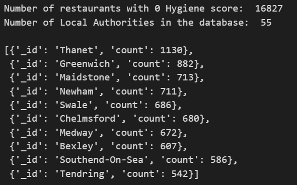

# nosql-challenge
## Challenge #12

---

**This repository contains the following** 

1. A main folder containing this Readme file, the file NOSQL-setup.ipynb and the file NOSQL-analysis.ipynb

2. The folder <mark>Resources</mark>  which includes the file establishments.json, source for the data of this project.

3. The folder <mark>Images</mark> with images of the results of the challenge

---
---
### Part 1. Database and Jupiter Notebook Set Up.

1. The database uk_food and collection establishments were created/imported with the code:

 - mongoimport --type json -d uk_food -c establishments --drop --jsonArray establishments.json

2. Libraries were imported.

3. The mongo client instance was created in port 27017. 

4. All the confirmations were done.

5. The collection was assigned to the variable establishments.

### Part 2. Update the database.

1. The establishments collection was succesfully updated with the new restaurant ("Penang Flavours").

2. The BussinesTypeID for the restaurants in the same category as 'Penang Flavours' is 1.

3. The BussinesTypeID  was updated in the 'Penang Flavours' document.

4. Thd database contained 944 documents with Dover as its local authority. Those documents were deleted from the collection establishments.

5. Latitude and longitude datatypes of all restaurants were changed to decimal numbers.  

---
### Part 2. Exploratory Analysis.
Here are the results for this part of the analysis, the pretty prints and dataframes created can be found in the NOSQL-analysis.ipynb file.

1. Forty one establishments with Hygiene score equals to 20 were found.

2. There were 34 restaurants in London with a Rating Value of at least 4.

3. The nearest establishments to "Penang Flavours" with Rating Value of 5 and sorted by lowest hygiene score are: 

4. There are 16827 restaurants with Hygiene score equal to zero divided into 55 Local Authorities in the database. A sample of the cleanest restaurants  can be seen below: 

